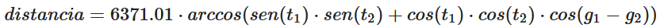

# PC1: Práctica Calificada
**course:** Programación II  
**unit:** 1 y 2   
**cmake project:** prog2_pc1_lab104_v2021_2

## Indicaciones Específicas
- El tiempo límite para la evaluación es 100 minutos.
- Cada pregunta deberá ser respondida en un archivo fuente (`.cpp`) y un archivo cabecera (`.h`) con el número de la pregunta:
    - `p1.cpp, p1.h`
    - `p2.cpp, p2.h`
    - `p3.cpp, p3.h`
- Deberás subir estos archivos directamente a [www.gradescope.com](https://www.gradescope.com) o se puede crear un `.zip` que contenga todos ellos y subirlo.

## Competencias
- Para los alumnos de la carrera de Ciencia de la Computación
    - Aplica conocimientos de computación apropiados para la solución de problemas definidos y sus requerimientos en la disciplina del programa.(nivel 2)
    - Diseña, implementa y evalúa soluciones a problemas complejos de computación.(nivel 2)
    - Crea, selecciona, adapta y aplica técnicas, recursos y herramientas modernas para la práctica de la computación y comprende sus limitaciones.(nivel 2)

- Para los alumnos de las carreras de Ingeniería
    - Capacidad para aplicar conocimientos de matemática.(nivel 2)
    - Capacidad para diseñar un sistema, un componente o un proceso para satisfacer las necesidades deseadas dentro de restricciones realistas(nivel 2)

### Pregunta #1 - Estructuras de control - Contar paginas (7 points)
  
Escribir un programa que recepcione una cantidad `n` y que verifique si ese número coincide con la suma de los números de las primeras páginas de un libro. En caso coincida debera devolver el número de páginas, si no devolverá la frase `"no coincide"`.

Ejemplo:
```markdown
Si n = 20 la respuesta es "no coincide" debido a que el mas cercano es 21
1 + 2 + 3 + 4 + 5 + 6 = 21

Si n = 30 la respuesta es "no coincide" debido a que el mas cercano es 36
1 + 2 + 3 + 4 + 5 + 6 + 7 + 8 = 36

Si n = 10 la respuesta es 4
1 + 2 + 3 + 4 = 10
```

#### Input Format
```cpp
20
```

#### Constraints
```cpp
- El ingreso de los valores no requiere utilizar etiquetas (std::cout)
```

#### Output Format
```cpp
no coincide
```
#### Ejemplo 1
**Input**
```cpp
30
```
**Output**
```cpp
no coincide
```

#### Ejemplo 2
**Input**
```cpp
10
```
**Output**
```cpp
4
```

### Pregunta #2 - función - Acido Ribonucleico (6 points)
  
Escribir un programa y crear la funcion `complemento_invertido` que busque el complemento invertido de un filamento de ácido ribonucleico (ARN). El ácido ribonucleico es representado por una cadena que contiene solo 4 caracteres: A, C, G y U. En una fibra solo se puede permitir un par de esos caracteres A/U o G/C.  

Por ejemplo: 
```markdown
- AAAA --> UUUU
- UUUU --> AAAA
- GGGG --> CCCC
- CCCC --> GGGG
```
La cabecera de la función debe ser:
```cpp
string complemento_invertido(string filamento);
```
#### Input Format
```cpp
UAAGGG
```

#### Constraints
```cpp
- El ingreso de los valores no requiere utilizar etiquetas (std::cout)
```

#### Output Format
```cpp
CCCUUA
```
#### Ejemplo 1
**Input**
```cpp
ACGGUGGGUUUUAC
```
**Output**
```cpp
GUAAAACCCACCUG
```

#### Ejemplo 2
**Input**
```cpp
AAAAAACCCCCGACUAAAAUUUUUUU
```
**Output**
```cpp
AAAAAAAUUUUAGUCGGGGGUUUUUU
```

### Pregunta #3 - Distancia Terrestre (7 points)

La superficie de la Tierra es curva y la distancia entre 2 longitudes varía con la latitud, por lo que encontrar la distancia entre 2 puntos es más complicado que simplemente usar el teorema de Pitágoras.


Dados  que son la latitud y longitud de 2 puntos en la Tierra. La distancia entre ambos puntos en kilómetros se calcula.

donde:  
`6371.01` es el radio de la tierra en kilómetros.

Escribir la funcion `calcular_distancia` que solicite la latitud y longitud de 2 puntos en la tierra y que muestre la distancia entre los puntos.

La cabecera de la función debe ser:
```cpp
double calcular_distancia(double t1, double g1, double t2, double g2);
// donde:
// t1, g1 son la latitud y longitud de un primer punto en la tierra
// t2, g2 son la latitud y longitud de un primer punto en la tierra
```
#### Input Format
```cpp
-12.0464     // Lima
-77.0428
-5.1783      // Piura
-80.6549
```

#### Constraints
```cpp
- El ingreso de los valores no requiere utilizar etiquetas (std::cout)
```
#### Output Format
```cpp
860.66
```
#### Ejemplo 1
**Input**
```cpp
-5.1783
-80.6549
-18.0203
-70.3321
```
**Output**
```cpp
1815.84
```


